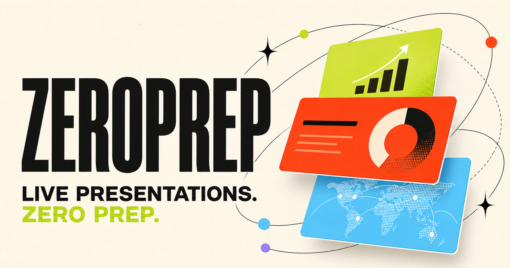

# ZeroPrep

**Your talk is your presentation.**

ZeroPrep listens while you speak and composes a live visual presentation around your ideas. It can hold the current scene, evolve it with more detail, or introduce a new visual beat without requiring a prepared slide deck.



## Demo

[](https://www.youtube.com/watch?v=oVaLFjXy2gY)

[Watch the ZeroPrep demo on YouTube](https://www.youtube.com/watch?v=oVaLFjXy2gY)

## Built with Codex at the Hyderabad hackathon

ZeroPrep started at the OpenAI Codex Hackathon in Hyderabad, where Ramsri and Danish met for the first time. Over the next day, we went from two strangers with a rough idea to a working product.

We used Codex with `gpt-5.6-sol` as a hands-on engineering partner throughout the build. Our loop was simple: explain what we wanted, let Codex inspect and change the codebase, try the result live, and bring back the rough edges. Codex helped us:

- Turn the initial idea into a working Next.js application
- Build and debug the realtime voice and visual-update flow
- Iterate on dynamic layouts, motion, microphone controls, and error handling
- Coordinate asynchronous generated imagery without letting stale responses replace newer scenes
- Add PDF and PowerPoint exports, then run builds and checks before shipping

What stood out was that Codex could keep track of the whole system—from WebRTC and model tool calls to React rendering and browser exports—while we focused on product decisions and tested how the experience felt. `gpt-5.6-sol` was used during development through Codex; it is not part of ZeroPrep's runtime model stack.

## What it does

- Listens continuously until the presenter stops the session
- Lets the presenter choose from available microphone inputs
- Uses GPT-Realtime 2.1 by default to understand live speech and direct visual changes
- Lets the presenter switch to GPT-Realtime 2.1 Mini for faster, lower-cost sessions
- Generates scene-aware background imagery asynchronously with Gemini 3.1 Flash Lite Image (Nano Banana 2 Lite)
- Renders animated presentation scenes with React, HTML, and CSS
- Builds heroes, cards, metrics, quotes, icons, and diagrams dynamically
- Downloads the completed presentation locally as PDF or PowerPoint
- Presents the live canvas in fullscreen

## Architecture

```text
Microphone
   └── WebRTC → ZeroPrep API → OpenAI Realtime
                                  └── visual tool calls
                                         └── React + HTML/CSS scenes

New scene → text and layout render immediately
          └── parallel Gemini image request
                    └── background fades in only if that scene is still current

Finished scenes → browser PDF/PPTX renderer → local device download
```

OpenAI and Gemini credentials remain server-side. Exported presentations are generated in the browser and downloaded directly to the presenter’s device; ZeroPrep does not upload or preserve them on a public server.

## Technology

- Next.js 16 and React 19
- OpenAI `gpt-realtime-2.1` by default, with `gpt-realtime-2.1-mini` selectable
- OpenAI `gpt-realtime-whisper` for the displayed live transcript
- Google Gemini `gemini-3.1-flash-lite-image` for non-blocking generated backgrounds
- jsPDF and html-to-image for PDF generation
- PptxGenJS for PowerPoint export
- Lucide for semantic iconography

## Run locally

Requirements: Node.js 22.13 or later.

```bash
npm install
cp .env.example .env.local
npm run dev
```

Open [http://localhost:3000](http://localhost:3000).

Add these values to `.env.local`:

```bash
OPENAI_API_KEY=your_openai_api_key
GEMINI_API_KEY=your_google_ai_studio_api_key
```

The voice experience needs `OPENAI_API_KEY`. Generated backgrounds need a Gemini API key from Google AI Studio in `GEMINI_API_KEY`. If that key is absent or an image fails, ZeroPrep stays fully functional with its original text, icons, motion, and layout.

## Deploy to Vercel

1. Import `https://github.com/ramsrigouthamg/zeroprep` into Vercel.
2. Keep the detected framework as **Next.js** and the project root as `./`.
3. Add `OPENAI_API_KEY` under **Project Settings → Environment Variables** for Production and Preview.
4. Add `GEMINI_API_KEY` from Google AI Studio for generated scene backgrounds.
5. Redeploy after the environment variables are available.
6. Open the production URL, create a presentation, stop listening, then download PDF or PowerPoint locally.

## Public-deployment safety

ZeroPrep applies same-origin checks and lightweight per-instance rate limits. For a public event or sustained traffic, also add Vercel Firewall rate-limit rules for:

- `POST /api/realtime`
- `POST /api/imagery`

This prevents anonymous visitors from creating excessive OpenAI sessions or Gemini image requests.

## Commands

```bash
npm run dev
npm run lint
npm run build
npm test
```

## License

MIT — see [LICENSE](LICENSE).
